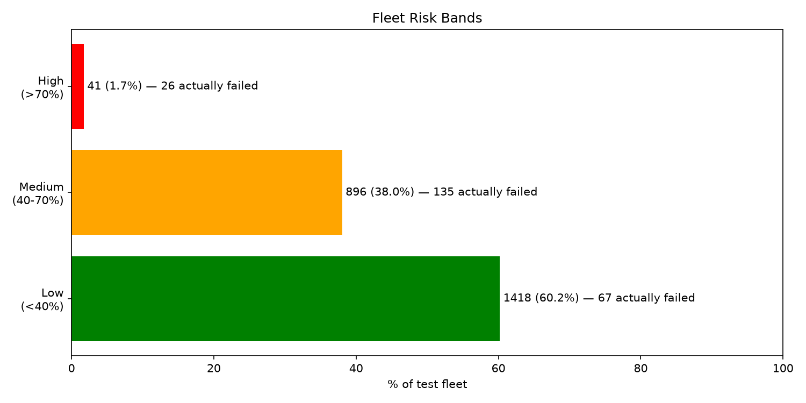
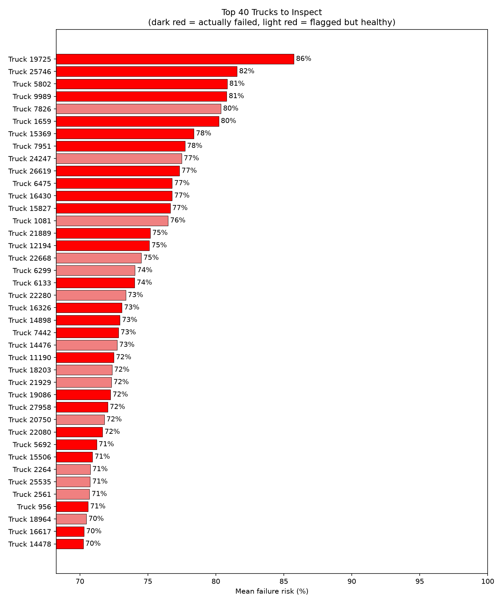
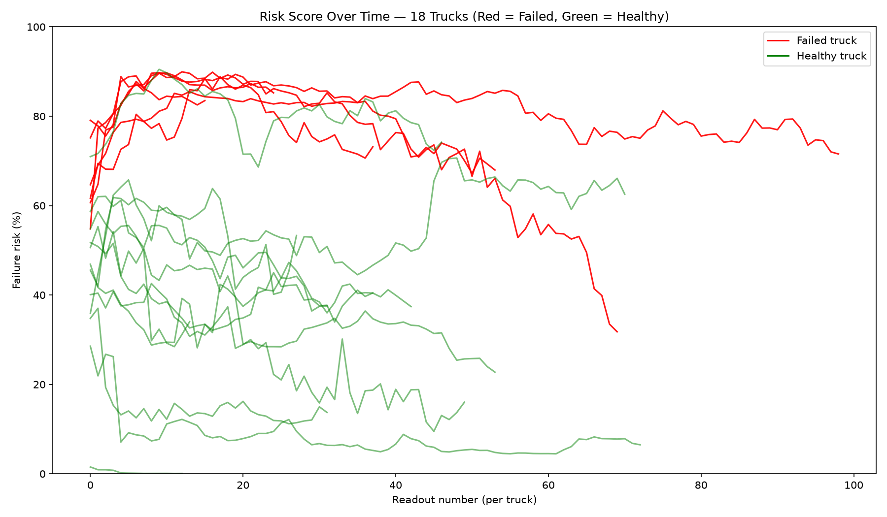
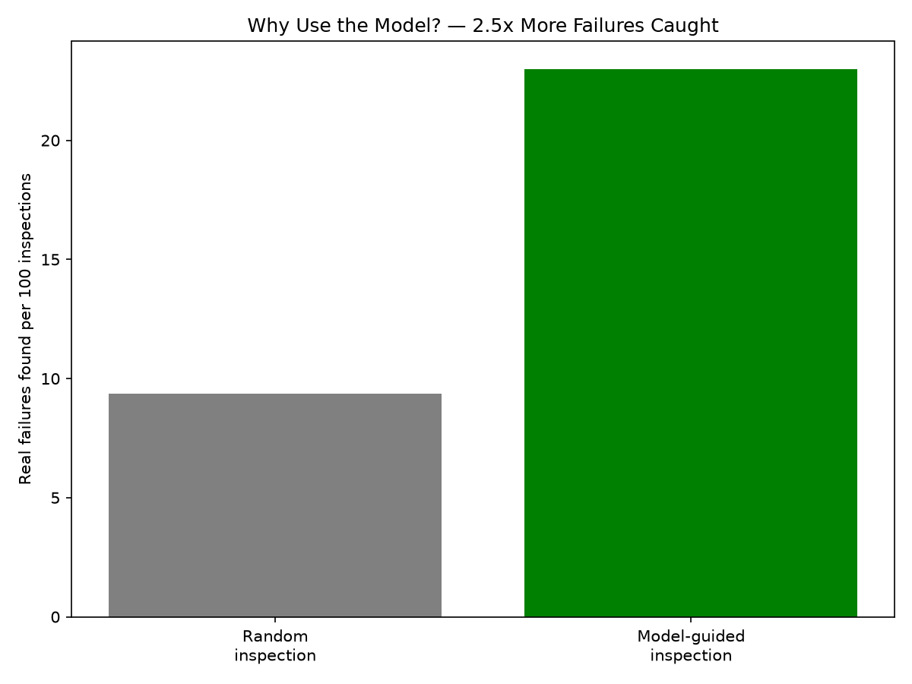
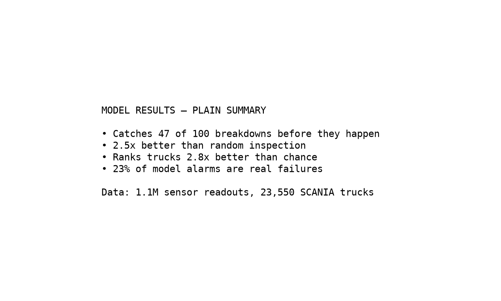
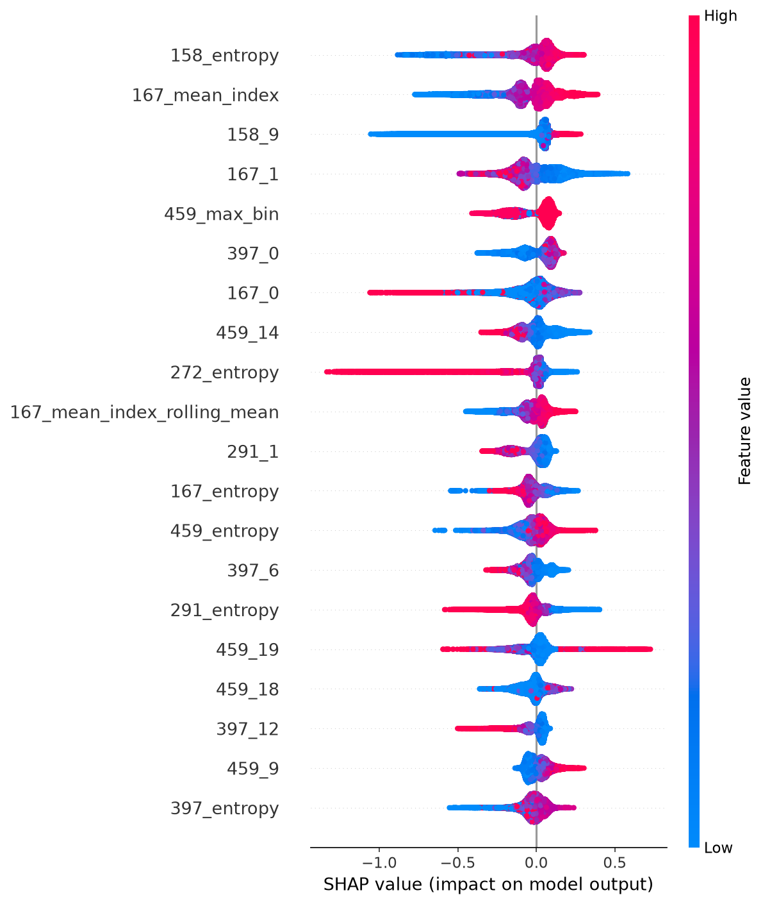
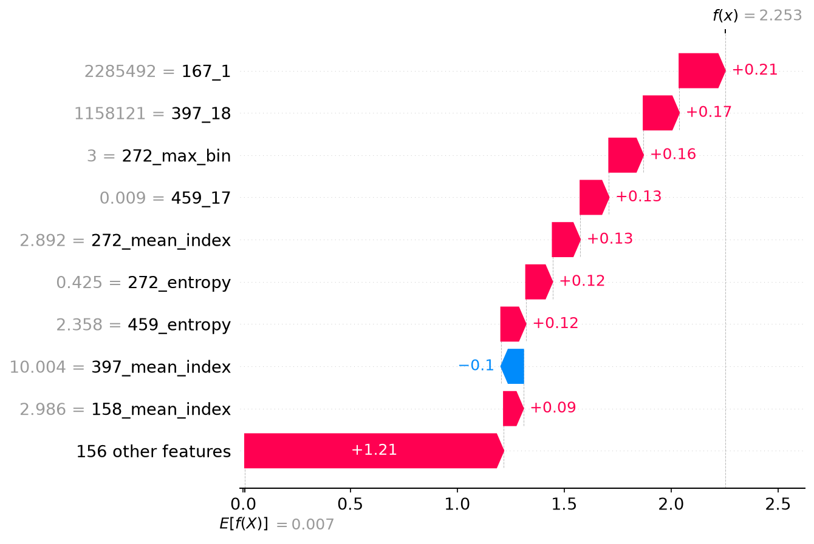

# Fleet Telematics Data Science Pipeline

> A modular, local-first data science pipeline for **predictive maintenance** — predicting vehicle component failures before they happen, keeping the fleet running safely on the highway, and reducing unplanned downtime.

---

## 🎯 Goal

Predict Component X failures in heavy-duty trucks from sensor telemetry so maintenance happens **before** breakdown, not after. Keep fleet vehicles on the road, not on the recovery truck.

---

## 📊 Dataset

[SCANIA Component X Dataset](https://doi.org/10.5878/jvb5-d390) — real-world multivariate time series from 23,550 SCANIA heavy-duty trucks, published in *Scientific Data* (2025).

| File | Rows × Cols | Role |
| :--- | ---: | :--- |
| `train_operational_readouts.csv` | 1,122,452 × 107 | Sensor readouts over time (anonymized features) |
| `train_tte.csv` | 23,550 × 3 | Repair labels (`in_study_repair`: 9.65% positive) |
| `train_specifications.csv` | 23,550 × 9 | Static truck specifications |

Placed in `data/scania/` locally (gitignored).

---

## 🛠️ Tech Stack & References

| Category | Technology | Purpose |
| :--- | :--- | :--- |
| **Core Language** | **[Python](https://www.python.org/)** | Core programming language for modular pipeline scripts. |
| **Package Manager** | **[uv](https://github.com/astral-sh/uv)** | Rapid dependency management and virtual environment setup. |
| **Database / OLAP** | **[DuckDB](https://duckdb.org/)** | Fast in-process SQL columnar storage and windowed aggregations. |
| **Data Engineering** | **[Pandas](https://pandas.pydata.org/)** & **[NumPy](https://numpy.org/)** | Data cleaning, boundary filtering, and vectorised calculations. |
| **Machine Learning** | **[XGBoost](https://xgboost.readthedocs.io/)** & **[Scikit-Learn](https://scikit-learn.org/)** | Training gradient boosted trees with vehicle-level stratified splits. |
| **Explainability** | **[SHAP](https://github.com/slundberg/shap)** | Model interpretation via global summaries and local waterfall plots. |

---

## 🏗️ Project Architecture

Built using modular Python scripts to demonstrate production-grade software engineering standards rather than unstructured notebooks:

| Phase | Module | Description |
| :--- | :--- | :--- |
| **Phase 1** | `ingest.py` | Load 3 SCANIA CSVs into DuckDB tables. |
| **Phase 2** | `cleaning.py` | NaN audit and imputation on 1.1M sensor readouts. |
| **Phase 3** | `features.py` | Per-vehicle rolling stats and deltas on counters, plus histogram-distribution features. |
| **Phase 4** | `train.py` | XGBoost classifier: 30-config randomised search, vehicle-level split, proxy-leak removal. |
| **Phase 5** | `explain.py` | SHAP global summary and local waterfall visualisations. |
| **Phase 6** | `visualise.py` | Plain-language charts for non-technical audiences. |

---

## 📈 Results

**The model ranks trucks by failure risk 2.8× better than random** (PR-AUC 0.257 vs 0.094 baseline) and makes inspections 2.5× more effective: 23% of model-guided inspections find a real failure vs 9.4% at random. Catches 47% of failures before they happen.

> **What SHAP caught:** the first model leaned on `mean_time_step` and `readout_count` — observation-length proxies (failed trucks are observed for fewer time steps). Both removed; these are the honest numbers.

Run the full pipeline: `uv run fleet`. Final metrics always land in `data/metrics.json`.

### Fleet risk overview — trucks bucketed by mean risk; 63% of the High band actually failed vs 4.7% in Low

### Top 40 trucks to inspect — the work queue; dark red = actually failed

### Risk over time — failed trucks (red) sit high, healthy (green) low

### Why use the model? — real failures found per 100 inspections: 9.4% random vs 23% model-guided

### Model performance (technical)

| Metric | Value | Baseline (all healthy) |
| :--- | ---: | ---: |
| PR-AUC | 0.257 | 0.094 |
| Recall | 47% | 0% |
| Precision | 23% | — |

### Which features drive predictions?

### Why the single highest-risk truck was flagged

